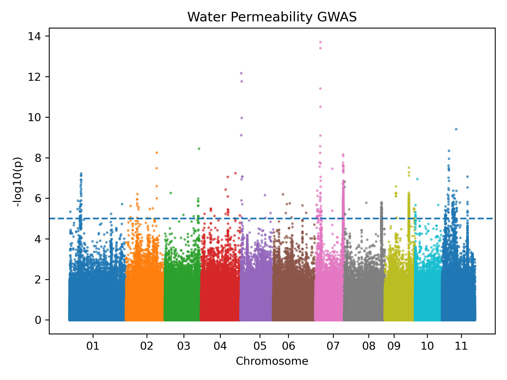
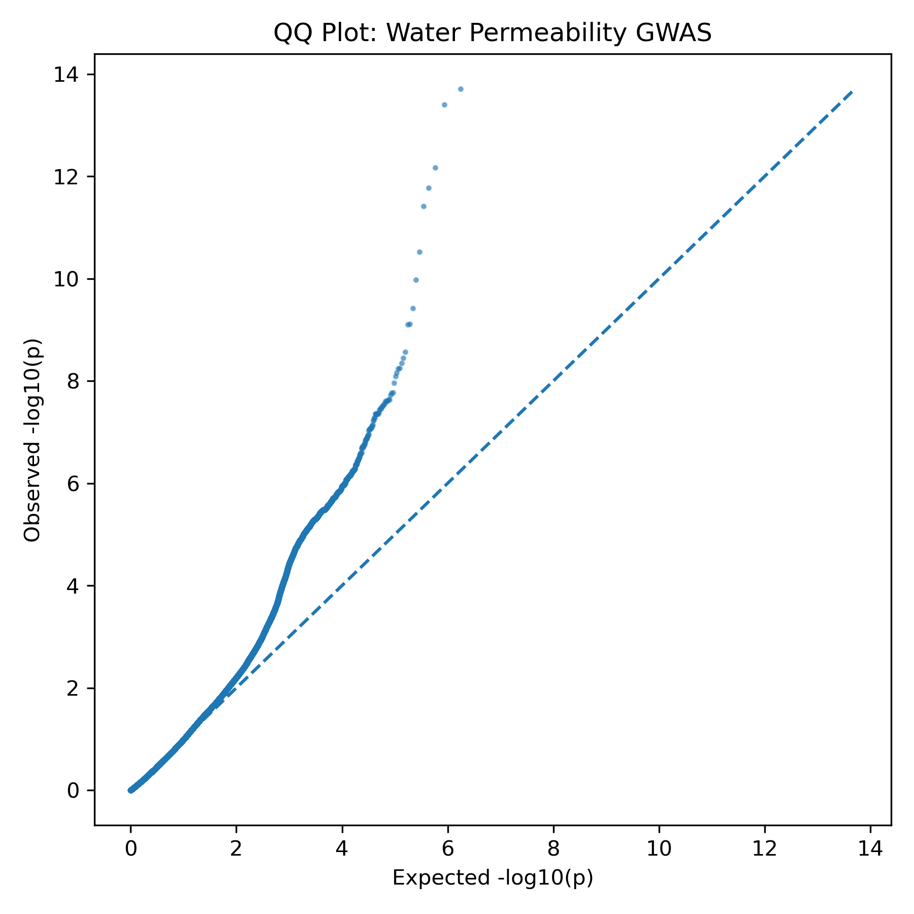
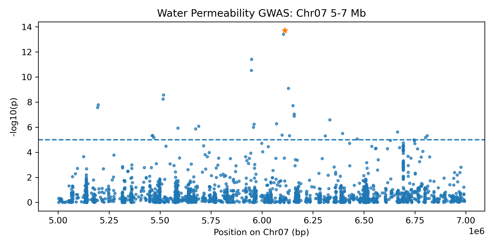
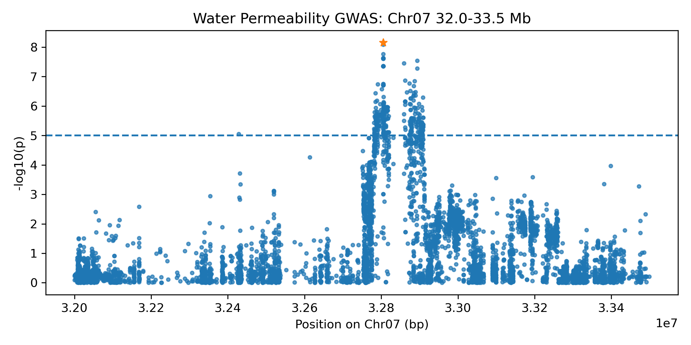
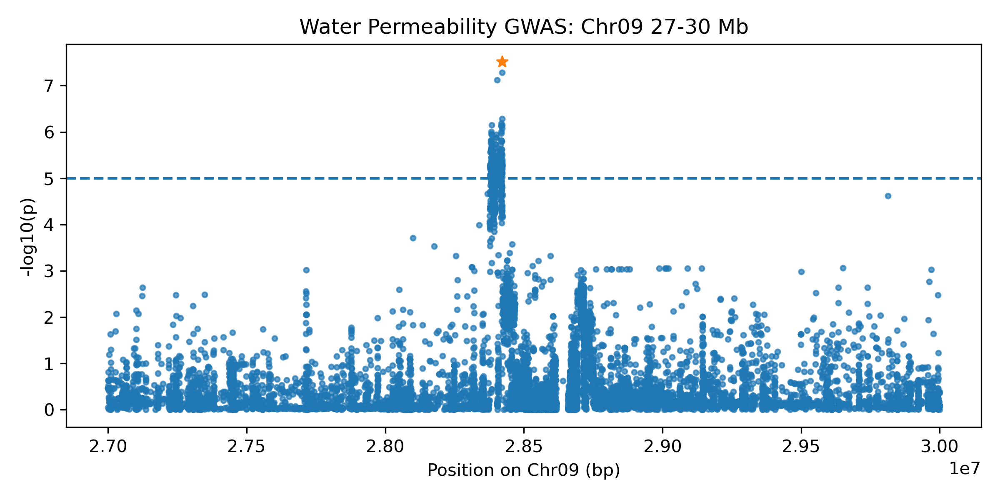
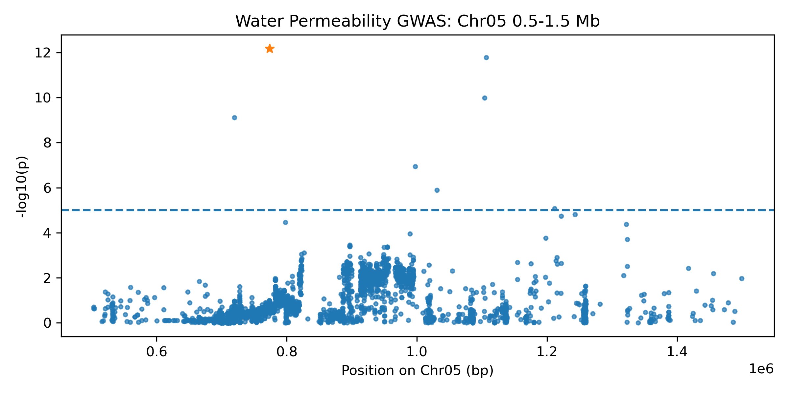
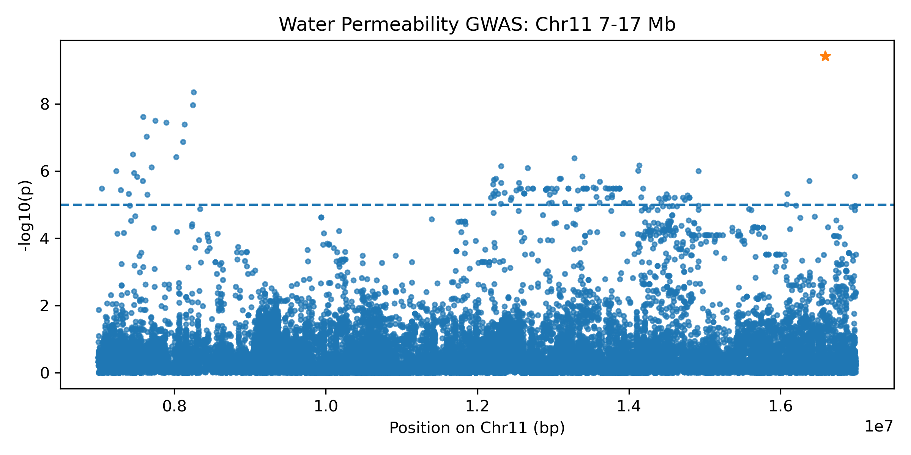

# adzuki-gwas-analysis

[ARMS計算候補の設計](docs/arms_design.md)は検証済みの候補周辺配列から行う。
計算候補、実験検証済みマーカー、育種集団で検証済みのパネルを区別する。

[候補周辺配列・近傍変異の抽出](docs/candidate_context.md)は、検証済みreference bundleを使い、
summaryとcohort VCFの情報源を分けて出力する。

参照配列を使う後続処理の入口は[参照ゲノム資産の契約 v1](docs/reference_bundle.md)を参照。
納品向け解析には[解析生成時の来歴](docs/analysis_provenance.md)の
`--record-provenance`／`--require-provenance`を使用する。
Miyagi／Shumari／Longxiaodou 4の実FASTA・注釈の取得済み／検証済みを意味しない。

アズキ（*Vigna angularis*）を対象とした、公開GWAS summary statistics（GWAS要約統計量）の
再現可能な検証・可視化・多重検定診断・関連シグナル整理・候補SNP優先順位付け・顧客向け
サマリー/監査成果物生成を行うPython workflow。

対象データはChien et al. 2025（*Science*）およびDryadで公開されているデータに基づく。

このリポジトリは**新規にGWASを実行するものではなく**、既に公開されているsummary statistics
を対象としたpost-hoc（事後）解析・整理・可視化・報告のためのツール群である。QTLの新規発見、
causal variant（原因変異）の同定、育種マーカーの検証を主張するものではない。

---

## このリポジトリでできること

現在実装済みの主な機能は以下の通り。

- manifestベースの入力契約とschema検証（`adzuki-gwas-validate`）
- Manhattan plot / QQ plot
- 任意領域のregional plot、region設定に基づくtop variant抽出
- Bonferroni補正（family-wise error rate, FWER）
- Benjamini-Hochberg FDR補正（false discovery rate）
- 遺伝的インフレ係数 lambda_GC（診断統計量）
- 6 GWAS datasetのbatch一括解析
- 物理距離（physical-distance）に基づく関連シグナルの整理
- lead variantの決定論的選定
- downstream validation priority（候補SNPの検証優先順位付け）
- 顧客向けMarkdownレポート（executive summary / technical report）の生成
- 再現性・監査用成果物（checksum、machine-readable manifest）の生成

以下は**実装されていない**（後続Issueとして別途トラッキング）。

- 参照ゲノム別の配列資産・座標契約の整備
- 関連SNP周辺のフランキング配列抽出
- ARMSマーカー候補・プライマー設計
- 顧客提供individual-level genotype/phenotypeによるGWAS実行
- liftover、LD解析、fine-mapping

---

## 解析対象データ

| 項目 | 内容 |
|---|---|
| 論文 | Chien et al. 2025, *Science* 388: eads2871 |
| DOI | https://doi.org/10.1126/science.ads2871 |
| Dryad | https://datadryad.org/dataset/doi:10.5061/dryad.8w9ghx3xv |

対象は以下の6 GWAS dataset（2参照ゲノム × 3形質）。

```text
Miyagi
  - water_permeability（吸水性）
  - red_seedcoat（赤色種皮）
  - mottled_black_seedcoat（斑紋黒色種皮）

Shumari
  - water_permeability
  - red_seedcoat
  - mottled_black_seedcoat
```

**MiyagiとShumariは異なる参照ゲノム座標系である。** 両者の座標を直接比較・統合すること
（liftoverなしでの座標変換や、同一chromosome番号・position値を同一locusとして扱うこと）は
行わない。姉妹リポジトリ [adzuki-snp-pipeline](https://github.com/hoso-jpn/adzuki-snp-pipeline)
が用いるLongxiaodou 4を含めると、Miyagi / Shumari / Longxiaodou 4は互換性のない3つの座標系
であり、このリポジトリの6 GWAS datasetはLongxiaodou 4を使用していない。

---

## 科学的な適用範囲と制約

このリポジトリの解析結果を読む前に、以下を必ず理解すること。

- **GWASを再実行していない。** 公開済みsummary statisticsのpost-hoc再解析・可視化のみ。
- `pval`は常にlikelihood-ratio-test（LRT）p-value（Dryadのデータ辞書による定義）。
  `p_wald`/`p_score`も検証対象だが、primary statisticとしては使用しない。
- Manhattan/regional plotの`1e-5`線は**legacy visualization threshold**であり、
  Bonferroni補正済み・genome-wide significanceのしきい値ではない。
- 関連シグナル（association signal）は**物理距離クラスタのみ**。LD block（連鎖不平衡ブロック）
  でも、独立に確立されたQTL区間でも、fine-mappingの結果でもない
  （個体別遺伝型が無いためLDを計算できない）。
- lead variantはcausal variant（原因変異）ではない。
- candidate（候補SNP）はcausal variant・検証済み育種マーカー（validated breeding marker）
  ではない。
- `priority_tier`はdownstream validation priority（検証優先度）であり、生物学的重要度
  ランキングでもcausal probability（原因である確率）でもない。
- BH-adjusted p-value（`pval_bh`）はStorey q-valueとは異なる推定量であり、そう呼ばない。
- lambda_GCは診断統計量に過ぎない。population stratification（集団構造）の有無、
  over-correction（過剰補正）、batch effect、polygenicity（多遺伝子性）のいずれかを
  lambda_GC単独から断定しない。

---

## クイックスタート

```bash
uv sync --locked
```

`pandas`/`numpy`/`matplotlib`/`scipy`は`pyproject.toml`/`uv.lock`にruntime依存として
宣言されており、別途condaなどの環境は不要。

生データはDryadからダウンロードし、`.assoc.txt`ファイルを`data/raw/`以下に配置する
（このリポジトリへはcommitしない。`.gitignore`参照）:

```
data/raw/mapped_to_Miyagi_water_permeability.maf_0.05.assoc.txt
```

検証（validation）は全コマンドで必須であり、省略できない。schema v1検証
（`validate_dataset()`、[Issue #1](https://github.com/hoso-jpn/adzuki-gwas-analysis/issues/1)/
[PR #2](https://github.com/hoso-jpn/adzuki-gwas-analysis/pull/2)）に失敗した入力からは、
plot・TSVのいずれも一切生成されない。範囲外・不正な行が黙って無視されることはない。

```bash
uv run adzuki-gwas-validate --manifest manifest.toml --data-dir data/raw
```

---

## CLI

`adzuki-gwas-analyze`（unified CLI）は以下のsubcommandを提供する。いずれも実行前に
schema v1検証を行い、検証に失敗した場合は出力を一切生成しない。

### 個別コマンド：`manhattan` / `qq` / `regional` / `regions` / `top-variants` / `all`

`manhattan`・`qq`・`regions`・`top-variants`はそれぞれ1種類の出力を`--output-dir`
（または`--output`で指定した直接のパス）へ書き出す。以下の例はいずれも
tracked（Git管理下）の`plots/`/`results/`へ直接書き込まない
（それらを再生成する経路は後述の[Legacy scripts](#legacy-scripts)を参照）:

```bash
INDIVIDUAL_OUTPUT_DIR="$(mktemp -d)"
uv run adzuki-gwas-analyze manhattan --output-dir "$INDIVIDUAL_OUTPUT_DIR"
uv run adzuki-gwas-analyze qq --output-dir "$INDIVIDUAL_OUTPUT_DIR"
uv run adzuki-gwas-analyze regions --output-dir "$INDIVIDUAL_OUTPUT_DIR"
uv run adzuki-gwas-analyze top-variants \
  --output "$INDIVIDUAL_OUTPUT_DIR/top_variants_by_region.tsv"

find "$INDIVIDUAL_OUTPUT_DIR" -maxdepth 1 -type f -print
```

`adzuki-gwas-analyze all`は**単一output directoryへまとめて書き出すbundleコマンド**で、
入力を1回検証したうえで以下を1回のpassで生成する。

- `<dataset_id>_manhattan.png`
- `<dataset_id>_qq.png`
- `--regions-config`に設定された各regionのregional plot PNG（`output_filename`で命名）
- `top_variants_by_region.tsv`

これは本READMEにcommitされている`plots/`/`results/`のレイアウトを再現するコマンドでは
**ない**（それは[Legacy scripts](#legacy-scripts)の役割）。個別コマンドとは別のscratch
directoryを使うこと（同じdirectoryを再利用すると、`all`のbundle出力が個別コマンドの
出力を上書きしてしまう）:

```bash
BUNDLE_OUTPUT_DIR="$(mktemp -d)"
uv run adzuki-gwas-analyze all --output-dir "$BUNDLE_OUTPUT_DIR"
find "$BUNDLE_OUTPUT_DIR" -maxdepth 1 -type f -print
```

共通フラグ: `--manifest`（既定 `manifest.toml`）、`--data-dir`（既定 `data/raw`）、
`--dataset-id`（既定 `miyagi_water_permeability`）、`--regions-config`（既定
`config/water_permeability_regions.toml`）、`--threshold`（既定 `1e-5`。legacy
visualization thresholdであり、後述のBonferroni/BH-FDRとは無関係）。

**`--output-dir`に直接`plots`を指定した場合（`--regions-config`が既定のとき）:**
schema検証は他のコマンドと同様に必ず先行するが、tracked成果物との一致確認や上書き確認は
行われない。具体的には`all`または`regions`の場合、

- 5つのregional plot PNGは`config/water_permeability_regions.toml`のtracked
  ファイルと同名のため、その場で置き換わる、
- `all`の`<dataset_id>_manhattan.png`/`<dataset_id>_qq.png`は別名の新規ファイルとして
  追加される（tracked済みの`water_permeability_manhattan.png`/
  `water_permeability_qq.png`は変更されない）、
- `all`の`top_variants_by_region.tsv`は`plots/`直下に追加され、
  `results/water_permeability/top_variants_by_region.tsv`へは書き込まれない。

### `diagnostics`（統計診断）

Bonferroni補正・Benjamini-Hochberg FDR補正・lambda_GCを1データセットに対して計算する。
詳細は[統計診断](#統計診断)を参照。

```bash
DIAGNOSTICS_OUTPUT_DIR="$(mktemp -d)"
uv run adzuki-gwas-analyze diagnostics --output-dir "$DIAGNOSTICS_OUTPUT_DIR"
find "$DIAGNOSTICS_OUTPUT_DIR" -maxdepth 1 -type f -print
```

常に2ファイルを生成する: `statistical_diagnostics.tsv`（1行のsummary）と
`significant_variants.tsv`（Bonferroni∪BH discoveryの和集合。元の入力行順。0件でも
header-onlyで生成される）。`--alpha`（既定`0.05`）と`--fdr-level`（既定`0.05`）は
互いに独立、かつ前述の legacy `--threshold`とも独立。このsubcommandは
`manhattan`/`qq`/`regional`/`regions`/`top-variants`/`all`の出力を変更しない。

### `batch`（6データセット一括解析）

`manifest.toml`に登録された**全6データセット**を、その宣言順のままManhattan + QQ +
Bonferroni/BH-FDR/lambda_GC診断で一括処理する。詳細は
[6データセット一括解析](#6データセット一括解析)を参照。

```bash
BATCH_OUTPUT_DIR="$(mktemp -d)"
uv run adzuki-gwas-analyze batch --output-dir "$BATCH_OUTPUT_DIR"
find "$BATCH_OUTPUT_DIR" -type f | sort
```

`--output-dir`は必須で、既に非空のdirectoryとして存在してはならない（batchは25ファイルを
all-or-nothingの単位でpublishする）。`--dataset-id`は無い（常に6データセットすべてを処理）。
`--alpha`/`--fdr-level`（既定いずれも`0.05`）と`--threshold`（既定`1e-5`、上述のlegacy
visualization線と同じ）は各データセットへ独立に適用される。`batch`はregional plotや
top-variant-by-region TSV（`miyagi_water_permeability`のpost-hoc regionに特化した機能）
は生成しない。

### `candidates`（候補SNP抽出）

1データセットの有意variant集合を物理距離でクラスタリングし、downstream validation
priorityを付与する。詳細は
[関連シグナルの整理と候補SNP優先順位付け](#関連シグナルの整理と候補snp優先順位付け)を参照。

```bash
CANDIDATES_OUTPUT_DIR="$(mktemp -d)"
uv run adzuki-gwas-analyze candidates \
    --output-dir "$CANDIDATES_OUTPUT_DIR" \
    --clustering-distance 50000
find "$CANDIDATES_OUTPUT_DIR" -maxdepth 1 -type f -print
```

`--clustering-distance`は必須引数で、**このリポジトリ内にsoftware defaultは存在しない**
（理由は後述）。上記の`50000`（bp）はコマンド例のための**使用例であり、推奨値・LD block
サイズ・生物学的に検証済みのwindowではない**。

`candidates`は`diagnostics`と同様に自己完結的（1回のvalidate + 1回のload）で、
`statistical_diagnostics.tsv`/`significant_variants.tsv`/`association_peaks.tsv`/
`candidate_snps.tsv`/`candidate_ranking.tsv`の5ファイルを生成する。

`adzuki-gwas-analyze batch --clustering-distance N`を指定すると、同じ3つのcandidate
ファイルが6データセット各々のdirectoryへ追加生成される（合計43ファイル）。
**`--clustering-distance`を指定しない場合、`batch`の既存25ファイル出力・
`batch_summary.tsv`の`schema_version=1`は完全に不変**であり、候補抽出はopt-in。

### `report`（顧客向けレポート・監査パッケージ）

candidate-enabledな`batch`出力を入力として、顧客向けレポートと監査用成果物一式を
生成する。詳細は[顧客向けレポートと監査パッケージ](#顧客向けレポートと監査パッケージ)を参照。

```bash
uv run adzuki-gwas-analyze report \
  --analysis-dir "$BATCH_OUTPUT_DIR" \
  --output-dir "$DELIVERY_DIR"
```

正式な入力契約は「`batch_summary.tsv`の`schema_version == 2`」（＝その`batch`実行が
明示的な`--clustering-distance`を指定していたこと）。`schema_version == 1`
（candidate未実行）の`batch`出力を渡すと、暗黙のclustering distanceを設定することなく
明示的に失敗する。`report`はGWASの再計算もcandidate rankingの再計算も行わない
——既存artifactのconsumer（消費者）である。

---

## 統計診断

`adzuki-gwas-analyze diagnostics`（[Issue #7](https://github.com/hoso-jpn/adzuki-gwas-analysis/issues/7)）
は、検証済みの`pval`列に対してBonferroni family-wise error rate（FWER）補正、
Benjamini-Hochberg false discovery rate（FDR）補正、遺伝的インフレ係数（lambda_GC）を
計算する。これは**既に公開済みのGWAS summary statisticsに
対するpost-hoc診断であり、GWASの再実行ではない**。population structure、kinship、
batch effectの再補正も行わない。

### 多重検定のfamily定義

familyは「**1つの`dataset_id` × manifestが宣言する`pvalue_columns.primary`列
（`pval`） × その1ファイルでschema v1検証を通過した全variant**」に固定される。
6つのDryadファイルを結合しない、Miyagi/Shumariを結合しない、3形質を結合しない、
post-hoc visualization regionを独立familyとして扱わない、`p_wald`/`p_score`を
`pval`の代わりに使わない。実装はmanifestオブジェクトから補正対象列名を読み取り
（`"pval"`のハードコードではない）、実際にloadしたp-value数がschema v1検証で
実カウントされた行数と一致することを検証する（`manifest.toml`の`row_count`を
無条件に信用しない）。

### Bonferroni補正

family-wise alphaの既定値は`0.05`。しきい値は`alpha / m`（`m`はfamilyの検定数）で、
`p <= alpha / m`（同値として`min(p * m, 1.0) <= alpha`）を満たすvariantが有意となる。
これは**そのデータセット自身の多重検定family専用のしきい値**であり、universalな
genome-wide significanceのしきい値ではない。またSNP間のlinkage disequilibrium（LD）
による補正は行っていない（`m`はLD-prunedされたeffective test countではなく生の
variant数）ため、保守的（conservative）になり得る。

### Benjamini-Hochberg FDR補正

`scipy.stats.false_discovery_control(pvalues, method="bh")`で計算する。補正後p-value
列は`pval_bh`で、これはBH-adjusted p-valueであり、**Storey-style q-value（別の推定量）
ではない**——本リポジトリではq-valueと呼称しない。`bh_raw_p_cutoff`は棄却された
variantのうち最大の生`pval`値、discoveryが0件の場合は空欄。

**依存構造に関する条件:** 元のBenjamini & Hochberg (1995)のFDR保証は独立性の下で成立し、
Benjamini & Yekutieli (2001)がpositive regression dependency on a subset（PRDS）の
下へ拡張した——これは「任意の依存構造」よりも狭い特定の条件である。本データセットの
SNPはlinkage disequilibriumにより相関しており、本リポジトリは`pval`がPRDSを満たすことを
**証明していない**。任意の依存構造下でのFDR制御を主張せず、1995年（独立性）と2001年
（PRDS）の結果を混同せず、Benjamini-Yekutieli補正自体は実装していない。

### 遺伝的インフレ係数（lambda_GC）

```
chi2_values     = scipy.stats.chi2.isf(pvalues, df=1)
expected_median = scipy.stats.chi2.ppf(0.5, df=1)
lambda_gc       = median(chi2_values) / expected_median
```

小さいp-valueでのcatastrophic cancellationを避けるためsurvival function側（`isf`）を
使用し、`-2 * log(p)`による近似は使わず、`expected_median`を固定値へ丸めず、
`p == 1`は`chi2 == 0`へ対応させる。lambda_GCは**診断値としてのみ**報告される:
本リポジトリのどこにおいても検定統計量やp-valueをlambda_GCで除算せず、
genomic-control補正済みp-valueも生成しない。lambda_GC単独では、population
stratification・kinship・batch effectのいずれが inflation の原因であるかを
確定・除外できない——polygenicity（多遺伝子性）もGWASの検定統計量を膨張させ、
lambda_GC単独ではconfoundingと区別できない（Bulik-Sullivan et al. 2015,
"LD Score Regression Distinguishes Confounding from Polygenicity"）。この区別を
可能にするLD Score regressionは、本リポジトリが個体別遺伝型もLD referenceも
持たないためscope外。

**`df=1`という仮定の根拠（正確に記載する）:** Dryadのデータセットmetadataは本archiveの
GWASがGEMMAで実行されたことを示し、Dryadのデータ辞書は`pval`をlikelihood-ratio-test
（LRT）p-valueと定義し、GEMMAのunivariate linear mixed model（出力列が本データセットの
schemaと厳密に一致する）は各SNPについて単一のスカラー効果`beta`を`H0: beta = 0`対
`H1: beta != 0`で検定し、`df=1`はこの単一自由パラメータの検定定式化から導かれる。
**論文本文のMethods/Supplementary Methodsは未確認**（`science.org`は`403 Forbidden`を
返し、アクセス可能なpreprintも見つからなかった）。したがって`df=1`は確認済みの出力契約と
GEMMAのモデル文書に基づく明示的な解析上の仮定であり、論文自体を読んで確認された事実
ではない。`df=1`と矛盾する情報が後日見つかった場合、lambda_GCは再評価されなければ
ならない。

### 実測値はその計測を行った1台のマシンの参考値に過ぎない

`diagnostics`について記録されているwall-time・peak-RSSの数値（Issue #7のPR説明内など）は、
ある1台のLinux x86_64マシン上のある1時点での実測値であり、1データセットの計算がメモリに
問題なく収まることを確認するために記録したものに過ぎない。パフォーマンスベンチマークでは
なく、他の環境について何かを保証するものでもない。

---

## 6データセット一括解析

`adzuki-gwas-analyze batch`（[Issue #9](https://github.com/hoso-jpn/adzuki-gwas-analysis/issues/9)）
は、`manifest.toml`に登録された**全データセット**を、その
ファイル自身の宣言順のまま、1コマンドでManhattan + QQ + Bonferroni/BH-FDR/lambda_GC
診断まで処理する。これは本リポジトリが公開GWAS datasetごとに生成する標準的・監査可能な
成果物セットである。この上に候補SNP抽出（`--clustering-distance`によるopt-in。後述の
[関連シグナルの整理と候補SNP優先順位付け](#関連シグナルの整理と候補snp優先順位付け)参照）
と顧客向けレポート生成（後述の
[顧客向けレポートと監査パッケージ](#顧客向けレポートと監査パッケージ)参照）が実装されている。
フランキングSNP抽出等は未実装のfollow-up。

### 1データセットにつきvalidation 1回・load 1回

6データセットそれぞれについて、`batch`はschema v1検証をちょうど1回、analysis用
DataFrameのloadをちょうど1回行い、そのDataFrameをManhattan plot・QQ plot・診断計算の
すべてで使い回す——同じファイルを2回目以降の成果物のために再検証・再loadすることはない
（`manhattan`/`qq`/`diagnostics`を個別に3回呼び出すとそうなってしまう）。2つ以上の
データセットのDataFrame・p-value配列・adjusted p-value配列が同時にメモリ上へ保持される
ことはない：各データセットの4ファイルが書き出された後は、そのデータセットの小さな結果
（スカラー値と出力相対パス）だけが次のデータセットの処理が始まる前まで残る。

### 各データセットは独立した多重検定family

上記の`diagnostics`と全く同様に、各データセットのfamilyは**その1つの`dataset_id` ×
`pval` × そのファイル自身でschema v1検証を通過したvariant**であり、他の5つとは
独立に計算・記録される。`batch`の実行は6ファイルを結合せず、Miyagi/Shumariを結合せず、
3形質を結合せず、6データセットの行数合計を共通の補正familyとして扱わない。その合計
——`miyagi_water_permeability`（1,741,385）、`miyagi_red_seedcoat`（1,255,203）、
`miyagi_mottled_black_seedcoat`（1,255,203）、`shumari_water_permeability`
（1,471,837）、`shumari_red_seedcoat`（1,232,183）、`shumari_mottled_black_seedcoat`
（1,232,183）で**8,187,994**行——は`batch_summary.tsv`上、処理件数の単純合計としてのみ
報告され、いかなるBonferroni/BH計算の`m`としても使われない。Miyagi座標とShumari座標は
`batch`の出力のどこにおいても比較されない。

### plotタイトルはtrait・reference genomeを反映する

各データセットのManhattan/QQタイトルはmanifestの`trait`/`reference`フィールドから
組み立てられる（`dataset_id`の文字列分割ではない）。固定のtrait表示名は以下の通り。

| `trait` | 表示名 |
|---|---|
| `water_permeability` | Water Permeability |
| `red_seedcoat` | Red Seed Coat Color |
| `mottled_black_seedcoat` | Mottled Black Seed Coat Color |

例えば`miyagi_water_permeability`はManhattan plotに`Water Permeability GWAS
(Miyagi reference)`、QQ plotに`QQ Plot: Water Permeability GWAS (Miyagi reference)`
というタイトルを表示する。単体の`manhattan`/`qq`subcommandとlegacyな
`scripts/01`-`04`は、`batch`の影響を受けず既存の既定タイトルのまま。

### 出力構成とtransaction semantics

```text
<output-dir>/
├── batch_summary.tsv
├── miyagi_water_permeability/       (4ファイル: _manhattan.png, _qq.png, statistical_diagnostics.tsv, significant_variants.tsv)
├── miyagi_red_seedcoat/             (4ファイル)
├── miyagi_mottled_black_seedcoat/   (4ファイル)
├── shumari_water_permeability/      (4ファイル)
├── shumari_red_seedcoat/            (4ファイル)
└── shumari_mottled_black_seedcoat/  (4ファイル)
```

合計25ファイル（6 × 4 + 1）。`--clustering-distance`を指定した場合、各データセット
directoryに3ファイル追加され合計43ファイルとなる（`schema_version`は2に切り替わる。
詳細は[`batch`のopt-inスキーマ](#batchのopt-inスキーマ)を参照）。全体は`--output-dir`と
同階層のstaging directoryへ一旦構築され、6データセットすべてと`batch_summary.tsv`が
成功して初めて所定の場所へ移動する。途中で失敗した場合（不正な
`--alpha`/`--fdr-level`/`--threshold`、validation失敗、行数不一致、plot/TSV書き込み
エラーなど）はstaging directoryを削除し`--output-dir`は変更されない——完成しているように
見える中途半端なbatchが残ることはない。

`batch_summary.tsv`は1データセット1行（manifest順）で、`statistical_diagnostics.tsv`と
同じ診断列に加え、`reference`、`trait`、`visualization_threshold`、4つのartifactパス
（`manhattan_path`、`qq_path`、`diagnostics_path`、`significant_variants_path`）を持つ
——常に`--output-dir`からの相対POSIXパスで、絶対パスやホスト固有のパスにはならない。

### 実データでのsmoke test：常にscratch directoryを使う

```bash
SMOKE_OUTPUT_DIR="$(mktemp -d)"
MPLBACKEND=Agg uv run adzuki-gwas-analyze batch --output-dir "$SMOKE_OUTPUT_DIR"
```

`--output-dir`を`plots/`や`results/`へ直接向けないこと。`batch`実行について記録される
wall-time/peak-RSSの数値は、それを計測したその1台のマシン上での参考値であり、他の環境
に対する性能保証・SLAではない。

---

## 関連シグナルの整理と候補SNP優先順位付け

[Issue #10](https://github.com/hoso-jpn/adzuki-gwas-analysis/issues/10)で追加された
`adzuki-gwas-analyze candidates`は、1データセット自身のBonferroni∪BH有意variant
（`diagnostics`/`batch`が`significant_variants.tsv`へ書き出すのと同じ集合）を物理距離で
"signal"へクラスタリングし、育種担当者がどの候補を先に確認すべきかを決定論的・監査可能な
順序で示す。これは**既に補正済みのsummary statisticsに対するpost-hocなconsumerであり、
新しい統計検定でも、linkage disequilibrium（LD）解析でも、GWAS再解析でもない**。

```bash
CANDIDATES_OUTPUT_DIR="$(mktemp -d)"
uv run adzuki-gwas-analyze candidates \
    --output-dir "$CANDIDATES_OUTPUT_DIR" \
    --clustering-distance 50000
find "$CANDIDATES_OUTPUT_DIR" -maxdepth 1 -type f -print
```

`candidates`は`diagnostics`と同様に自己完結的である：データセットの検証とloadをそれぞれ
1回行い、同じBonferroni/BH/lambda_GC診断を計算したうえで、`statistical_diagnostics.tsv`、
`significant_variants.tsv`、`association_peaks.tsv`、`candidate_snps.tsv`、
`candidate_ranking.tsv`の5ファイルを書き出す——常にその実行自身の`--alpha`/`--fdr-level`
と整合しており、別の（パラメータが異なるかもしれない）`diagnostics`実行の古いファイルを
読み返すことはない。

`adzuki-gwas-analyze batch --clustering-distance N`は、同じ3つのcandidateファイルを
6データセットそれぞれのdirectoryへ追加的に生成する（合計43ファイル）。**`batch`から
`--clustering-distance`を省略した場合、既存の25ファイル出力・`schema_version=1`は
完全に不変**——候補抽出はopt-inであり、他のsubcommandの既定動作を変更しない。

### 科学的な適用範囲——出力を解釈する前に必ず読むこと

本リポジトリには個体別遺伝型データが無いため、**ここでlinkage disequilibrium（LD）を
計算することはできない**。この制約を踏まえ、

- "signal"は**物理距離クラスタのみ**である——同一データセット・同一chromosome上で、
  `--clustering-distance`（bp）以内の間隔にある有意variantを連鎖的にマージしたもの
  （signal内の他のいずれかのvariantとの距離が基準であり、signal内の最初のvariantとの
  距離だけを見るわけではない）。これは**LD blockではなく**、**独立に確立されたQTL区間
  でもない**。
- signalの**lead variant**は、本リポジトリ自身の決定論的tie-break規則（後述）が最初に
  選ぶvariantに過ぎない。**causal variant（原因変異）であるとは主張しない**し、同じ
  signal内の他のvariantがそれの単なるproxyであるとも主張しない。
- `priority_tier`/`priority_reasons`は**downstream validation priority**（次に確認
  すべき優先順位）を表す——既に計算済みで説明可能な量（そのデータセット自身のBonferroni/
  BH有意フラグ）のみから構築される。これは**生物学的重要度ランキングでも**、**true
  positiveである確率でも**、**実験的に検証済みの育種マーカーでもない**。
- `dataset_id`/`reference`/`trait`は全出力行に保持される。signalが複数のchromosomeや
  複数のdatasetにまたがることはなく、Miyagi/Shumariの座標は`diagnostics`/`batch`と
  全く同様に、結合・比較・共同クラスタリングされることはない。

### `--clustering-distance`にdefaultが無い理由

本リポジトリ内には、科学的に正当化できるクラスタリングwindowのdefault値が存在しない。
既存の`config/*_regions.toml`のwindow
（[post-hoc visualization regionについて](#post-hoc-visualization-regionについて)参照）は
Manhattan plotを目視して人間が選んだpost-hocな可視化windowであり、LDやQTL区間の推定値
ではない。また本リポジトリには個体別遺伝型が無いため、LDベースのwindowを導出すること
自体ができない。したがって`--clustering-distance`は`candidates`および（opt-inされた
場合の）`batch`の**両方で必須**であり、本リポジトリが暗黙に値を仮定することはない。
本READMEの例で使われる値（例：`50000`）はあくまで例示であり、推奨値ではない。

### クラスタリング規則

1データセットの有意variant集合を、chromosomeごと（自然な数値順——`Chr2`は`Chr10`より
前——であり辞書式順ではない）にグループ化し、position順に並べたうえで: 現在openな
signal内の最大positionとの間隔が`--clustering-distance`を超えた時点で新しいsignalを
開始する。これは**連鎖マージ（chained merge）**である——既にクラスタ済みの近傍との
距離が基準のため、一連のvariant群は端から端まで`--clustering-distance`を超えて広がり
得る。このルールは`association_peaks.tsv`の各行の`clustering_method`列にそのまま
記録され、本節を参照しなくてもファイル単体で自己記述的になっている。

### lead variantとtie-break

signalのlead variantは以下の順で決定される: (1) primaryの`pval`が最小、(2) 同値なら
`|beta|`（effect sizeの絶対値。schema v1が全行についてfiniteな実測値であることを
保証している）が最大、(3) さらに同値ならpositionが最小、(4) 完全に同値な場合
（例：同一位置のmulti-allelicレコードで`pval`と`|beta|`が共に同一）は入力
`.assoc.txt`ファイル内での出現順。これは既存の
[regional top variant選定](#regional-plots)（`select_top_variant`。同値なら
純粋にfile出現順で決める、candidate優先順位付けの主張を伴わない関数）とは意図的に
異なる——ここでのlead variantは育種担当者に提示される見出し候補であるため、
偶然のfile順ではなくeffect sizeに基づくtie-breakを採用している。

いずれの場合も**lead variant ≠ causal variant**である。

### priority_tierとpriority_reasons

`priority_tier`はBonferroni-significantな候補で`1`、Benjamini-Hochberg FDRのみで
有意な候補で`2`——`diagnostics`が既に計算した2つのboolean flagのみから決まり、追加の
重み付け・スコア式・隠れたパラメータは無い。`candidate_rank`はデータセット全体の候補集団
を`priority_tier`優先、続いてlead variant選定と同じtie-breakで並べ替えたもの。
`priority_reasons`はセミコロン区切りの完全に説明可能なリスト（例：
`bonferroni_significant;lead_variant_of_signal;member_of_multi_variant_signal`）——
生物学的重要度の確率であるかのような単一の不透明なスコアではない。

`priority_tier`/`priority_reasons`は**downstream validation priority（検証優先度）**
であり、**生物学的重要度ランキングでもcausal probabilityでもvalidated markerランキング
でもない。**

### 出力ファイル

```text
<output-dir>/
├── statistical_diagnostics.tsv
├── significant_variants.tsv
├── association_peaks.tsv     (1 signal = 1行)
├── candidate_snps.tsv        (1有意variant = 1行、genome順)
└── candidate_ranking.tsv     (1有意variant = 1行、priority順)
```

`association_peaks.tsv`の列: `schema_version`, `dataset_id`, `reference`, `trait`,
`signal_id`, `chromosome`, `start`, `end`, `n_significant_variants`, `lead_pos`,
`lead_allele1`, `lead_allele0`, `lead_pval`, `lead_pval_bonferroni`, `lead_pval_bh`,
`clustering_method`, `clustering_distance`。

`candidate_snps.tsv`の列: `schema_version`, `dataset_id`, `reference`, `trait`,
`signal_id`, `chr`, `pos`, `allele1`, `allele0`, `af`, `beta`, `pval`,
`pval_bonferroni`, `pval_bh`, `bonferroni_significant`, `bh_significant`,
`is_lead_variant`。

`candidate_ranking.tsv`の列: `schema_version`, `dataset_id`, `reference`, `trait`,
`signal_id`, `chr`, `pos`, `allele1`, `allele0`, `candidate_rank`, `priority_tier`,
`priority_reasons`。

3ファイルとも常に生成される（データセットに有意variantが0件でもheader-onlyで生成され、
ファイル自体が省略されることはない）——`significant_variants.tsv`の既存の規約と同じ。

### `batch`のopt-inスキーマ

`run_batch(..., clustering_distance=None)`（既定）は、本リポジトリが従来から生成して
きたものと全く同じ25ファイルツリー・`batch_summary.tsv` `schema_version=1`を生成する。
`clustering_distance`を指定すると`batch_summary.tsv`は`schema_version=2`となり、
`clustering_distance`、`n_signals`、`n_candidates`、`association_peaks_path`、
`candidate_snps_path`、`candidate_ranking_path`列が追加される——いずれもデータセット
ごとに独立して計算・報告され、6データセット共通のranking集団として扱われることはない。

### このセクションで明示的にscope外のもの

参照ゲノム別の配列資産・座標契約、フランキング配列・周辺variant抽出、ARMSマーカー候補・
プライマー設計は、別の既にトラッキング済みのfollow-up issueである
（[関連リポジトリ](#関連リポジトリ)およびこのリポジトリのissue trackerを参照）——
**このセクションではいずれも実装していない。** この節の出力の上に構築される
顧客向けレポート生成は実装済みであり、後述の
[顧客向けレポートと監査パッケージ](#顧客向けレポートと監査パッケージ)を参照。

---

## 顧客向けレポートと監査パッケージ

[Issue #11](https://github.com/hoso-jpn/adzuki-gwas-analysis/issues/11)で追加された
`adzuki-gwas-analyze report`は、**新しい解析ではなくconsumer（消費者）**である。既存の
candidate-enabledな`batch`出力を、非専門家向けの短いexecutive summary・詳細な
technical report・machine-readableな監査証跡を含む自己完結的なdelivery packageへ
変換する。`.assoc.txt`ファイルの再検証、Bonferroni/BH/lambda_GCの再計算、candidateの
再クラスタリングのいずれも行わない——`batch`が既に生成したartifactを読み取り、
整合性を確認し、再パッケージするだけである。

```bash
BATCH_OUTPUT_DIR="$(mktemp -d)"
uv run adzuki-gwas-analyze batch --output-dir "$BATCH_OUTPUT_DIR" --clustering-distance 50000

DELIVERY_DIR="$(mktemp -d)"
uv run adzuki-gwas-analyze report --analysis-dir "$BATCH_OUTPUT_DIR" --output-dir "$DELIVERY_DIR"
find "$DELIVERY_DIR" -maxdepth 2 -print | sort
```

### 正式な入力契約：candidate-enabledな`batch`出力のみ

`--analysis-dir`は、`batch_summary.tsv`が`schema_version=2`である`batch`出力
（＝その`batch`実行が明示的な`--clustering-distance`を指定していたこと。前述の
[関連シグナルの整理と候補SNP優先順位付け](#関連シグナルの整理と候補snp優先順位付け)参照）
でなければならない。`schema_version=1`（candidate未実行）の`batch`出力は、暗黙の
clustering distanceを設定して処理を続行するのではなく、「rerun batch with an
explicit --clustering-distance」という具体的な行動を示すエラーで**明示的に拒否**
される——`report`は呼び出し側に代わってパラメータを勝手に発明しない。

### 出力構成

```text
<output-dir>/
├── executive_summary.md
├── analysis_report.md
├── artifacts/
│   ├── batch_summary.tsv
│   └── <dataset_id>/   (batchがそのデータセットについて書き出した7ファイルをそのままコピー)
└── reproducibility/
    ├── input_checksums.tsv       (dataset_id, reference, trait, source_sha256)
    ├── software_versions.json    (report生成環境のみ。詳細は後述)
    └── run_manifest.json         (パラメータ、データセットごとの件数、scientific scope、
                                    配布済み全ファイルのchecksum付き一覧)
```

明示的なallowlistに載ったderived artifactのファイル名のみがコピーされる——
ディレクトリの再帰コピーではなく、raw `.assoc.txt`ファイルも**含まれない**。
`executive_summary.md`/`analysis_report.md`内のすべての参照はdelivery package
ルートからの相対パスであり、パッケージを他のマシンへコピーしても自己完結したまま
参照が壊れない。

### 何も書き出す前に行うcross-artifact整合性検証

report内容を生成する前に、`report`は`batch_summary.tsv`と各データセットの
`statistical_diagnostics.tsv`/`significant_variants.tsv`/`association_peaks.tsv`/
`candidate_snps.tsv`/`candidate_ranking.tsv`を読み込み、それらが互いに矛盾していない
ことを確認する: `n_tests`/Bonferroni・BH discovery件数/lambda_GCが`batch_summary.tsv`
とそのデータセット自身のdiagnosticsファイルの間で一致すること、`n_signals`/
`n_candidates`が対応するファイルの行数と一致すること、各ファイルの`dataset_id`/
`reference`/`trait`がその行の値と一致すること、`candidate_rank`が密な`1..n`の連番で
あること、candidateが参照する`signal_id`が`association_peaks.tsv`に実在すること。
候補0件のデータセット（header-onlyファイル、`n_candidates=0`）は正常かつ完全に検証
された状態であり、エラーではない。何らかの不整合が見つかった場合はreport生成を出力なしで
中止する——`report`は自らのsource dataと黙って矛盾するreportを生成しない。

### `software_versions.json`が主張すること・主張しないこと

`report`が消費するbatch/candidate artifact自体は、それらを生成したsoftware
versionやGit commitを記録していない。したがって`software_versions.json`は
**report自身を生成している環境のみ**（`report_generation_environment`: Python
version、platform、本パッケージおよびruntime依存関係のversion、best-effortで検出した
ローカルのGit commit）を記録し、`analysis_generation_environment`には文字列
`"unavailable_from_source_artifacts"`を設定する——report生成環境を、不明な解析生成
環境の代わりとして扱うことは決してない。

### 機密性（confidentiality）とoffline実行

delivery packageには`os.environ`、hostname（`platform.node()`は呼び出さない）、
username、絶対ファイルシステムパスのいずれも含まれない。`report`のどこにおいても
ネットワークアクセス・外部サービス・LLM呼び出しは発生しない——report本文はすべて
固定のoffline文字列テンプレートから生成される。

### 科学的な適用範囲（上記セクションと同一）

`report`は、[統計診断](#統計診断)と
[関連シグナルの整理と候補SNP優先順位付け](#関連シグナルの整理と候補snp優先順位付け)で
既に確立した制約を、再解釈するのではなくそのまま踏襲する: これは既に公開済みの
summary statisticsに対するpost-hoc再解析である（GWAS自体は再実行していない）。
association signalは物理距離クラスタのみであり、LD blockでも独立に確立されたQTL区間
でもない。lead variantとcandidateはcausal・validated breeding markerであるとは
主張しない。`priority_tier`は生物学的重要度ランキングではなくdownstream validation
priorityである。Miyagi/Shumariの座標、または2つ以上のデータセットのcandidateが、
1つの共通rankingへ結合されることはない。

### atomic publication

`batch`と同じstaging directory → `os.replace`のtransactionパターンを使用する
（安全性チェック自体は`analysis/output_safety.py`で共有）: package全体は
`--output-dir`と同階層のstaging directoryへ構築され、全ステップが成功して初めて
publishされる。何らかの失敗（不正な`--analysis-dir`、path safety違反、
cross-artifactの不整合、途中のI/Oエラー等）はstaging directoryを削除し、
`--output-dir`は変更されない。

### 実データでのsmoke test：常にscratch directoryを使う

```bash
SMOKE_ANALYSIS_DIR="$(mktemp -d)"
MPLBACKEND=Agg uv run adzuki-gwas-analyze batch \
    --output-dir "$SMOKE_ANALYSIS_DIR" --clustering-distance 50000

SMOKE_DELIVERY_DIR="$(mktemp -d)"
uv run adzuki-gwas-analyze report \
    --analysis-dir "$SMOKE_ANALYSIS_DIR" --output-dir "$SMOKE_DELIVERY_DIR"
```

`batch`の場合と同様、上記の`50000`はこのsmoke test自身の例示parameterであり、
推奨defaultではない——本リポジトリにdefaultは存在しない。いずれの`--output-dir`も
`plots/`や`results/`へ直接向けないこと。

---

## 代表的な解析結果：Miyagi water permeability

以下はこのリポジトリにcommitされている代表的な図・表であり、`miyagi_water_permeability`
データセットを例としたものである。**一方、上記CLI（`batch`/`candidates`/`report`を
含む）自体は、manifestに登録された6 GWAS dataset全てのbatch解析に対応している** ——
以下の代表例は、ソフトウェアの対応範囲がwater permeabilityのみに限定されることを
意味しない。

### Manhattan plot



### QQ plot



### Region別top variant

> 注: 以下のregional windowはManhattan plotの目視確認に基づきpost-hoc（事後的）に
> 選定されたものであり、可視化目的のみに用いる。独立に確立されたQTL区間として
> 解釈しないこと。

| Region | Chr | Position | Beta | p-value |
|---|---|---|---|---|
| Chr07 5-7 Mb | Chr07 | 6,112,438 | 0.205 | 1.95e-14 |
| Chr05 0.5-1.5 Mb | Chr05 | 773,719 | 0.224 | 6.71e-13 |
| Chr11 7-17 Mb | Chr11 | 16,588,878 | 0.148 | 3.82e-10 |
| Chr07 32.0-33.5 Mb | Chr07 | 32,805,358 | 0.131 | 6.93e-09 |
| Chr09 27-30 Mb | Chr09 | 28,421,501 | 0.098 | 3.03e-08 |

注: Beta値は、元のGWAS summary statisticsに記録されているlinear mixed modelによる
effect size推定値である。表現型のスケール・厳密な解釈は元データセットの定義に従う。

### Regional plots

#### Chr07: 5–7 Mb



#### Chr07: 32.0–33.5 Mb



#### Chr09: 27–30 Mb



#### Chr05: 0.5–1.5 Mb



#### Chr11: 7–17 Mb



### post-hoc visualization regionについて

上記5つのchromosome windowおよび
[`config/water_permeability_regions.toml`](config/water_permeability_regions.toml)に
定義されているwindowは、genome-wide Manhattan plotの目視確認によりpost-hocに選ばれた
ものである。**独立に確立されたQTL区間ではなく**、**LD blockでもなく**、いかなる
linkage解析・fine-mapping解析の出力でもない——可視化上の便宜としてのみ扱うこと。

### `results/water_permeability/top_snps.tsv`について

このファイルの生成規則は**未確認**である。このリポジトリのGit履歴上、このファイルを
生成したスクリプトは存在せず、本README・関連issueもその再構築・再生成を試みない。
scope外の、未解決の論点として引き続きトラッキングする。

---

## Legacy scripts

以下は既存の後方互換ラッパーである。

| Script | 説明 | 入力 | 出力 |
|---|---|---|---|
| `01_manhattan_plot.py` | water permeability GWASのgenome-wide Manhattan plot | `data/raw/mapped_to_Miyagi_water_permeability.maf_0.05.assoc.txt` | `plots/water_permeability_manhattan.png` |
| `02_qq_plot.py` | GWAS品質管理用のQQ plot | （同上） | `plots/water_permeability_qq.png` |
| `03_regional_plot.py` | 指定したchromosome区間のregional association plot | GWAS summary statistics、chromosome、start/end position | Regional plot PNG |
| `04_extract_top_variants_by_region.py` | 設定済みの各可視化windowごとにtop variantを抽出 | GWAS summary statistics + `config/water_permeability_regions.toml` | `results/water_permeability/top_variants_by_region.tsv` |

これらのscriptは`src/adzuki_gwas_analysis/analysis/`の薄いラッパーであり、unified CLI
と同じ必須validationを実行し同じ出力を生成する。既存のcommand-line引数もそのまま。
これらのscriptは`miyagi_water_permeability`専用であり、6データセット全体には対応して
いない（6データセット対応は上記のunified CLIの`batch`/`candidates`/`report`を参照）。
`adzuki-gwas-analyze all`/`regions`（scratch directory向けのbundle command。前述）
とは異なり、これらのwrapperがtracked済みの`plots`/`results/water_permeability/`
artifactを既存の名前・配置のまま再生成するための正規の経路である。

この目的で実行する前にworking treeがcleanであることを確認し（`git status`）、実行後は
再生成された出力を無検討でcommitするのではなく、何が変わったかを確認すること——例えば
PNGについては`git diff --stat -- plots results`、
`results/water_permeability/top_variants_by_region.tsv`についてはbyte-for-byteの
`cmp`など:

```bash
python scripts/01_manhattan_plot.py
python scripts/02_qq_plot.py
python scripts/03_regional_plot.py \
  --input data/raw/mapped_to_Miyagi_water_permeability.maf_0.05.assoc.txt \
  --chrom Chr07 \
  --start 5000000 \
  --end 7000000 \
  --output plots/water_permeability_Chr07_5_7Mb_regional.png \
  --title "Water Permeability GWAS: Chr07 5-7 Mb"

python scripts/03_regional_plot.py \
  --input data/raw/mapped_to_Miyagi_water_permeability.maf_0.05.assoc.txt \
  --chrom Chr07 \
  --start 32000000 \
  --end 33500000 \
  --output plots/water_permeability_Chr07_32_33_5Mb_regional.png \
  --title "Water Permeability GWAS: Chr07 32.0-33.5 Mb"

python scripts/03_regional_plot.py \
  --input data/raw/mapped_to_Miyagi_water_permeability.maf_0.05.assoc.txt \
  --chrom Chr09 \
  --start 27000000 \
  --end 30000000 \
  --output plots/water_permeability_Chr09_27_30Mb_regional.png \
  --title "Water Permeability GWAS: Chr09 27-30 Mb"

python scripts/03_regional_plot.py \
  --input data/raw/mapped_to_Miyagi_water_permeability.maf_0.05.assoc.txt \
  --chrom Chr05 \
  --start 500000 \
  --end 1500000 \
  --output plots/water_permeability_Chr05_0_5_1_5Mb_regional.png \
  --title "Water Permeability GWAS: Chr05 0.5-1.5 Mb"

python scripts/03_regional_plot.py \
  --input data/raw/mapped_to_Miyagi_water_permeability.maf_0.05.assoc.txt \
  --chrom Chr11 \
  --start 7000000 \
  --end 17000000 \
  --output plots/water_permeability_Chr11_7_17Mb_regional.png \
  --title "Water Permeability GWAS: Chr11 7-17 Mb"

python scripts/04_extract_top_variants_by_region.py
```

---

## 入力データ契約とmanifest

[Issue #1](https://github.com/hoso-jpn/adzuki-gwas-analysis/issues/1) /
[PR #2](https://github.com/hoso-jpn/adzuki-gwas-analysis/pull/2)で、machine-readableな
manifest（`manifest.toml`）とschema validator（`src/adzuki_gwas_analysis/`）が
追加された。上記Dryad datasetの6つのGWAS summary-statisticsファイル全て（3形質 × 2
参照ゲノム：Miyagi、Shumari）をカバーする。完全な契約——6データセットの一覧、
Miyagi/Shumari（およびLongxiaodou 4）が互換性のない座標系である理由、`pval`が本
リポジトリのprimary statisticとして採用されているlikelihood-ratio-test p-valueである
理由、生データの入手・checksum検証方法、validatorの実行方法——は
[`docs/gwas_input_contract.md`](docs/gwas_input_contract.md)を参照。生データはこの
リポジトリへ一切commitされない。

[Issue #3](https://github.com/hoso-jpn/adzuki-gwas-analysis/issues/3)は上記の
`miyagi_water_permeability`専用legacy scriptをこのvalidator/loaderへ移行した
（他の5データセットへのlegacy script移行は行っていない。ただしunified CLIの
`batch`/`candidates`/`report`は6データセット全てに対応済み——上記
[CLI](#cli)節を参照）。

```bash
uv sync --locked
uv run adzuki-gwas-validate --manifest manifest.toml --data-dir data/raw
```

---

## 開発者向け：実データでのsmoke test

`adzuki-gwas-analyze all`を実データの`data/raw/`ファイルに対してscratch directoryへ
出力してsmoke testし（`plots/`や`results/`へ直接出力しない）、tracked済みファイルと
比較する:

```bash
OUTPUT_DIR="$(mktemp -d)"
uv run adzuki-gwas-analyze all --output-dir "$OUTPUT_DIR"
find "$OUTPUT_DIR" -maxdepth 1 -type f -print
cmp "$OUTPUT_DIR/top_variants_by_region.tsv" \
    results/water_permeability/top_variants_by_region.tsv
```

`$OUTPUT_DIR`下のregional/Manhattan/QQのPNGは、tracked済みの`plots/`ファイルと目視で
比較する（寸法・内容）。本リポジトリはPNGのbyte-for-byte一致は主張せず、TSVの一致と
PNGの寸法・内容の一致のみを主張する。

これは正確性の確認であり、性能ベンチマークではない。本リポジトリの履歴（Issue/PR説明）
のどこかに記録されているwall-time・peak-memoryの数値は、その検証を実行した特定の
マシン上での実測値であり、1データセットずつ処理することでメモリに問題なく収まることを
確認するために記録したものに過ぎない——他の環境に対する性能保証・SLAでは決してない。

`batch`/`candidates`/`report`の6データセット全体に対する実データsmoke testについては、
それぞれ[6データセット一括解析](#6データセット一括解析)、
[関連シグナルの整理と候補SNP優先順位付け](#関連シグナルの整理と候補snp優先順位付け)、
[顧客向けレポートと監査パッケージ](#顧客向けレポートと監査パッケージ)の各節を参照。

---

## 関連リポジトリ

- [adzuki-snp-pipeline](https://github.com/hoso-jpn/adzuki-snp-pipeline)
- [genomic-prediction-resnet-hybrid](https://github.com/hoso-jpn/genomic-prediction-resnet-hybrid)

---

## 著者

**Hoso**
Plant Genetics x Bioinformatics x Physical AI

- GitHub: https://github.com/hoso-jpn
- Researchmap: https://researchmap.jp/hosokawa-yusuke

---

## ライセンス

MIT License
